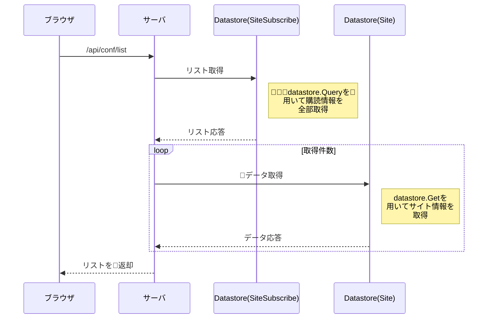

## manifest.json

PWAとして動作させるために記述が必要となる。

128x128サイズのアイコンはホーム画面からの起動時にスプラッシュ画面に使用される。

-----
## indexedDB
クライアント側で何か保存したいものがある場合に使用する。

- Dexie.js

indexedDBはそのままでは使用しにくいので、ライブラリを使用する。
http://dexie.org/

-----
## API

### 購読サイトリスト取得

endpointに紐づく購読中のサイト情報を全て返却する。

#### インターフェース

| 属性 | 値 |
| --- | --- |
| パス | /api/conf/list |
| パラメータ(必須) | endpoint |

#### シーケンス

### 購読サイト削除

購読情報から指定されたサイトを削除する。

#### インターフェース

| 属性 | 値 |
| --- | --- |
| パス | /api/conf/remove |
| パラメータ(必須) | endpoint |
| パラメータ(必須) | feedUrl |

#### シーケンス

#### TODO

リスト取得時にkeysOnlyを付与できれば取得コストが下げられる。

## markdown

参考サイト

https://mermaidjs.github.io/sequenceDiagram.html
