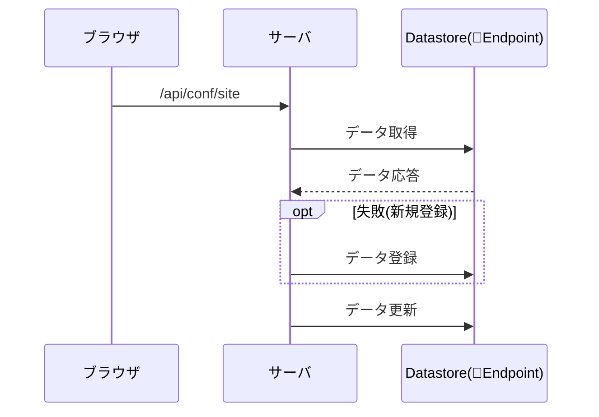
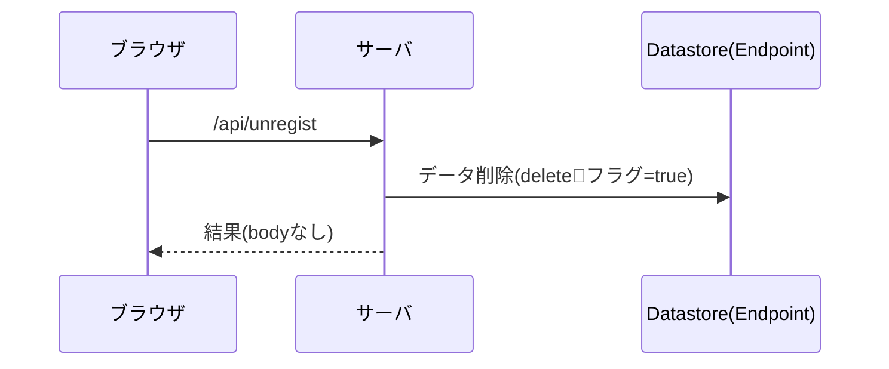
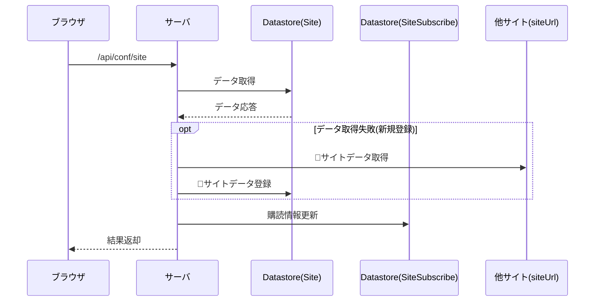
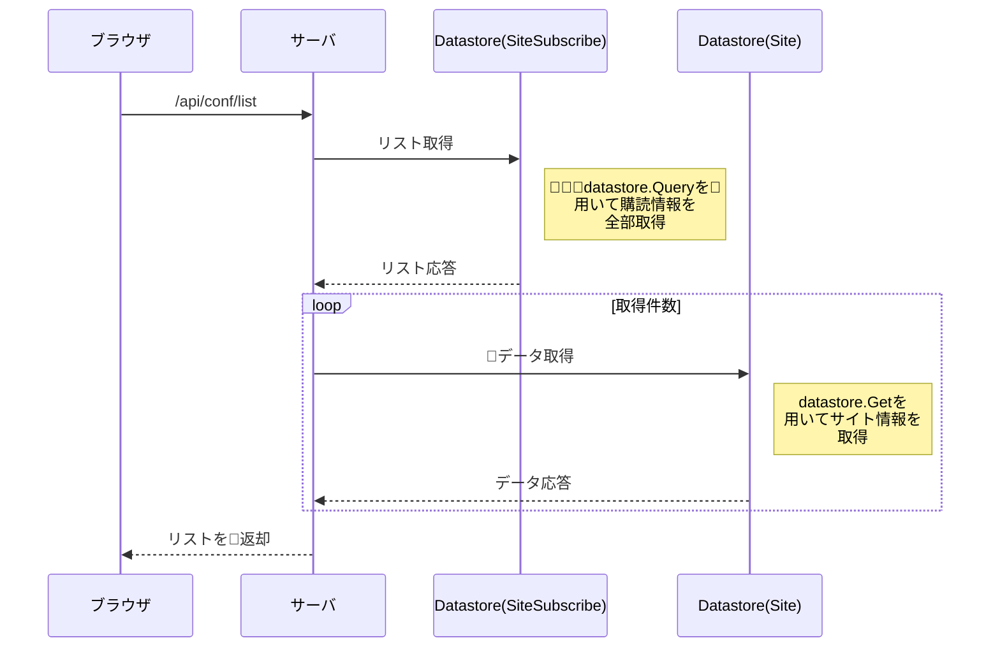
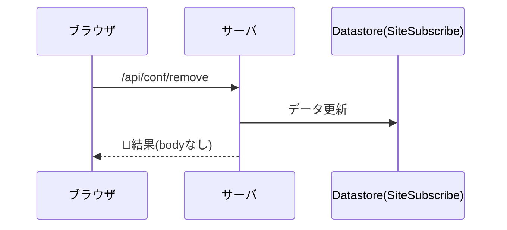

## manifest.json

PWAとして動作させるために記述が必要となる。

128x128サイズのアイコンはホーム画面からの起動時にスプラッシュ画面に使用される。

-----
## indexedDB
クライアント側で何か保存したいものがある場合に使用する。

- Dexie.js

indexedDBはそのままでは使用しにくいので、ライブラリを使用する。
http://dexie.org/

-----
## データ構造

### テーブル一覧

| テーブル名 | 役割 |
| ---: | :--- |
| Endpoint | エンドポイント=通知先(ブラウザ)を管理する |
| Site | 巡回するサイトの情報を管理する |
| SiteSubscribe | エンドポイントに紐づくサイト情報を管理する |
| Content | サイトを巡回して得たコンテンツ情報を管理する |
| Property | プロパティを管理する |
| ServerKey | サーバのキー情報(鍵ペア)を管理する |

-----
### プロパティ一覧

| プロパティ名 |  |
| ---: | :--- |
| google.custom.search.apikey | googleカスタムサーチAPIを使用するのに必要なキー情報 |
| google.search.engine.id | google検索エンジンのID |

-----
## API

### エンドポイント登録

endpointを登録する。

#### インターフェース

| 属性 | 値 | デフォルト |
| --- | --- | --- |
| パス | /api/regist | |
| パラメータ(必須) | endpoint | |
| パラメータ(必須) | p256dh | |
| パラメータ(必須) | auth | |

#### シーケンス

-----
### エンドポイント解除

endpointを解除する。

#### インターフェース

| 属性 | 値 | デフォルト |
| --- | --- | --- |
| パス | /api/unregist | |
| パラメータ(必須) | endpoint | |

#### シーケンス

-----
### 購読サイト設定

endpointに紐づく購読中のサイト情報を設定する。

#### インターフェース

| 属性 | 値 | デフォルト |
| --- | --- | --- |
| パス | /api/conf/site | |
| パラメータ(必須) | endpoint | |
| パラメータ(必須) | siteUrl | |
| パラメータ(オプション) | value | false |

#### シーケンス

-----
### 購読サイトリスト取得

endpointに紐づく購読中のサイト情報を全て返却する。

#### インターフェース

| 属性 | 値 |
| --- | --- |
| パス | /api/conf/list |
| パラメータ(必須) | endpoint |

#### シーケンス

-----
### 購読サイト削除

購読情報から指定されたサイトを削除する。

#### インターフェース

| 属性 | 値 |
| --- | --- |
| パス | /api/conf/remove |
| パラメータ(必須) | endpoint |
| パラメータ(必須) | feedUrl |

#### シーケンス

-----
## cron

### サイト更新情報通知

サイトを巡回し、更新情報があれば登録されたendpointに通知する。

#### インターフェース

| 属性 | 値 |
| --- | --- |
| パス | /admin/api/cron |

-----
### ヘルスチェック

endpointに不可視の通知を行い、無効なendpointを検出する。

#### インターフェース

| 属性 | 値 |
| --- | --- |
| パス | /admin/api/health |

-----
### サイト情報クリーンナップ

不要な情報を削除する。

#### インターフェース

| 属性 | 値 |
| --- | --- |
| パス | /admin/api/cleanup |

-----
## TaskQueue

### サイト更新通知

サイトのFeed情報を読み込み、更新を検知した場合はWebPushで購読しているエンドポイントへ通知を行う。

#### インターフェース

| 属性 | 値 |
| --- | --- |
| パス | /admin/api/publish |
| パラメータ(必須) | FeedURL |

-----
## markdown

参考サイト

https://mermaidjs.github.io/sequenceDiagram.html
